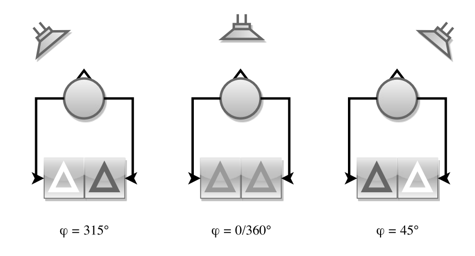
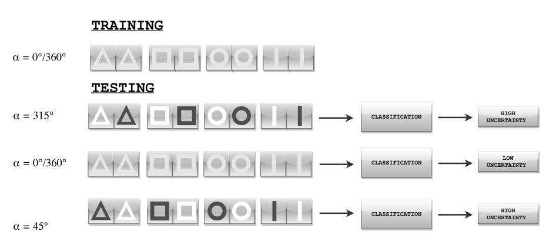

## Uncertainty-Based Binaural Source Localization

### Overview

Typically, source localization can be formulated as a classification problem, where each direction of arrival (DOA) is treated as a separate class. Each class is characterized by distinct binaural features such as 
Interaural Time Differences (ITD) and Interaural Level Differences (ILD). These features are extracted from signals captured at two acoustic sensors (e.g., ears or microphones). By learning the representative feature values for different DOAs, a model can classify new audio data as belonging to one of the learned classes—effectively estimating the sound source direction.

### Bayesian Framework for Classification

A Bayesian classifier provides a natural way to approach this task. It estimates the probability distribution over classes for a given data point.
In source localization, the classifier computes the probability that an observed signal originates from a particular DOA. The most probable DOA corresponds to the class with the highest posterior probability.
This probabilistic framework also allows for analyzing classification uncertainty, which is especially useful for localization tasks.

### Our approach: Beyond DOA Classes

Instead of explicitly dividing data into DOA classes, classifiers can also be trained to recognize sound events (e.g., phonemes, words). In this case:
Features encode binaural information for both ears simultaneously. Data points implicitly carry information about the source direction.
For example, when presenting a phoneme to a Bayesian classifier: Normally, the classifier would assign it to the most likely phoneme class.
In this work, however, we focus not on the classification result itself, but on the posterior distribution as a measure of uncertainty.

### Using Classification Uncertainty for DOA Estimation

The key idea in this approach is that classification uncertainty varies with DOA: If the classifier is trained only on data with DOA = 0° (front), then it will show low uncertainty for sounds coming from the front.
For sounds from other DOAs, classification becomes less certain. In Bayesian terms, the posterior distribution becomes broader and less peaked.
By evaluating uncertainty across different possible DOAs, it is possible to infer the direction of the sound source:
The direction with the lowest uncertainty (highest confidence) indicates the most likely source location.

### Summary

This framework shifts the perspective of source localization:
Instead of directly classifying DOAs, we use classification uncertainty as a cue.
Bayesian posteriors serve not just to assign labels, but as indicators of directional information.
This makes it possible to estimate the direction of arrival of a sound source, even when the classifier itself is trained only on limited directional data.

  
   
  <em> Figure 1: Schematic view of interaural differences as the DOA changes - location of the sound
source determines the binaural input. If the source is in front of the receiver, the inputs to the left
and right ear are similar (both shapes equally dark). When the source is located at azimuth of
45 to either side, the input to one ear will be higher (brighter shape) than the input to other ear
(darker shape). </em>
     
  
   
  <em> Figure 2: Schematic view of training and testing data sets presented to the NN. Top: NN is trained
for the data corresponding to a source in front of the receiver (left and right side of a pattern have
similar values). Bottom: classification (testing) is done for data corresponding to a di↵erent DOA.
The higher the angular distance between source and receiver, the more modified the signal is with
respect to training data. This leads to higher classification uncertainty. </em> 

